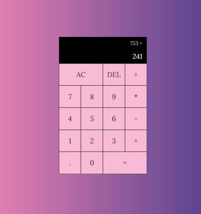

# Personal Project Making a Basic Calculator 
 

<https://youtu.be/j59qQ7YWLxw>
Following this tutorial as an aid, I create a similar calculator. 

- I learned how to use classes in JavaScript to create an object with multiple properties.
- Using the calculator object function properties to execute the basic operation of a calculator.
- Using a switch statement to conduct the basic operations.
- Then connecting those functions to the button on the HTML through the DOM.
- Getting the display to show the users current and previous inputs.
- Getting the answer of the operation to display correctly and the current input field.
- Getting the AC button to clear both fields.
- Having the DEL button work as a back space.

Fantastic and fun tutorial to practice basic principles in JavaScript.
